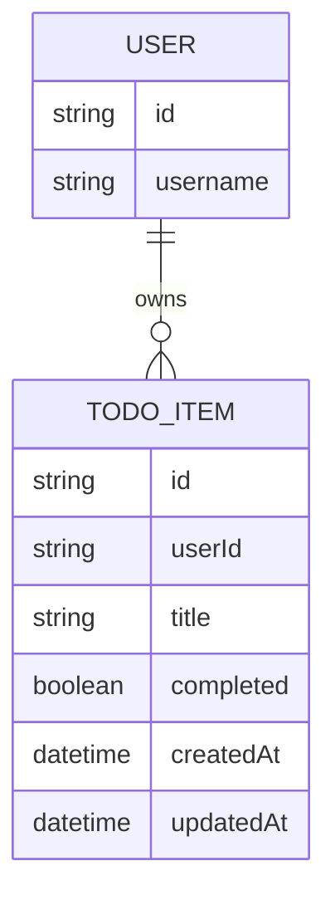

# Domain Model

A signed-in User owns zero or more private TodoItems; no entity is shared between users.

`USER` is resolved from the sign-in identity (Thunder) and is not stored by this
project — `TODO_ITEM.userId` is the only link, scoping every row to its owner.